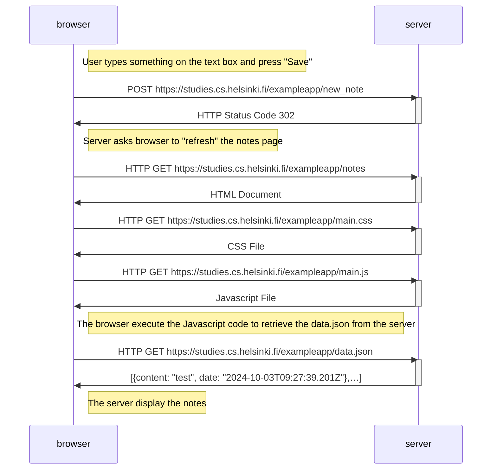
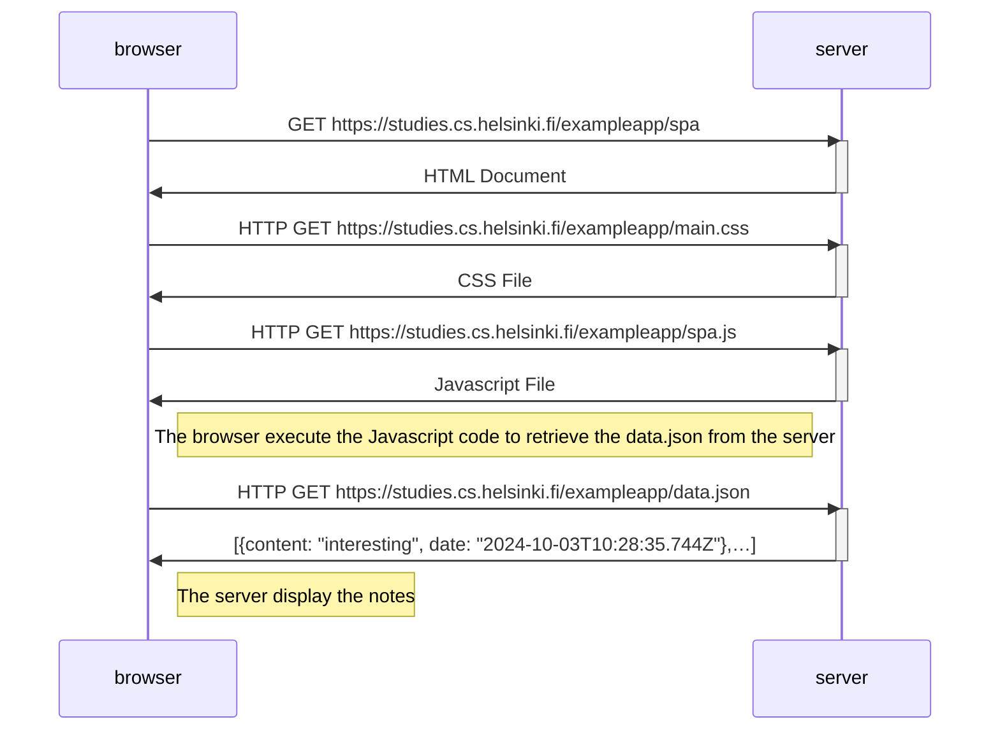
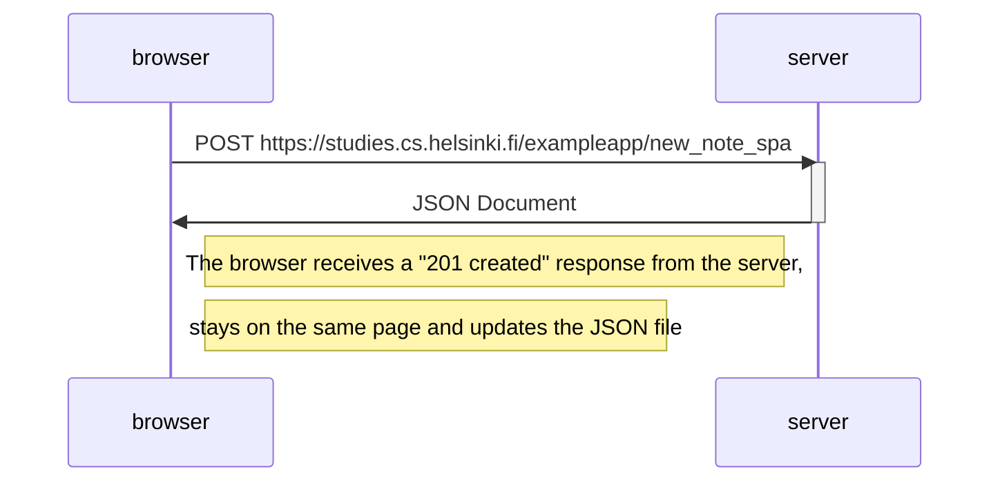

#Exercises Part 0

##Exercise 0.4: New note diagram

```
sequenceDiagram
    participant browser
    participant server

    Note right of browser: User types something on the text box and press "Save"
    browser->>server: POST https://studies.cs.helsinki.fi/exampleapp/new_note
    activate server
    server->>browser: HTTP Status Code 302
    deactivate server
    Note right of browser: Server asks browser to "refresh" the notes page

    browser->>server: HTTP GET https://studies.cs.helsinki.fi/exampleapp/notes
    activate server
    server->>browser: HTML Document
    deactivate server

    browser->>server: HTTP GET https://studies.cs.helsinki.fi/exampleapp/main.css
    activate server
    server->>browser: CSS File
    deactivate server

    browser->>server: HTTP GET https://studies.cs.helsinki.fi/exampleapp/main.js
    activate server
    server->>browser: Javascript File
    deactivate server

    Note right of browser: The browser execute the Javascript code to retrieve the data.json from the server

    browser->>server: HTTP GET https://studies.cs.helsinki.fi/exampleapp/data.json
    activate server
    server->>browser: [{content: "test", date: "2024-10-03T09:27:39.201Z"},…]
    deactivate server

    Note right of browser: The server display the notes
```



##Exercise 0.5: Single page app diagram

```
sequenceDiagram
    participant browser
    participant server


    browser->>server: GET https://studies.cs.helsinki.fi/exampleapp/spa
    activate server
    server->>browser: HTML Document
    deactivate server

    browser->>server: HTTP GET https://studies.cs.helsinki.fi/exampleapp/main.css
    activate server
    server->>browser: CSS File
    deactivate server

    browser->>server: HTTP GET https://studies.cs.helsinki.fi/exampleapp/spa.js
    activate server
    server->>browser: Javascript File
    deactivate server

    Note right of browser: The browser execute the Javascript code to retrieve the data.json from the server

    browser->>server: HTTP GET https://studies.cs.helsinki.fi/exampleapp/data.json
    activate server
    server->>browser: [{content: "interesting", date: "2024-10-03T10:28:35.744Z"},…]
    deactivate server

    Note right of browser: The server display the notes
```



##Exercise 0.6: New note in Single page app diagram

```
sequenceDiagram
    participant browser
    participant server


    browser->>server: POST https://studies.cs.helsinki.fi/exampleapp/new_note_spa
    activate server
    server->>browser: JSON Document
    deactivate server

    Note right of browser: The browser receives a "201 created" response from the server,
    Note right of browser: stays on the same page and updates the JSON file
```


